# CustomShellBar v9

A custom Windows shell bar built with Python and Tkinter.

CustomShellBar replaces the standard taskbar visually while adding:

- virtual desktop switching
- a keyboard-first launcher
- pinned apps
- CPU / RAM / GPU / network stats
- theme presets
- a built-in config panel
- import / exportable JSON profiles

---

## Features

- Alt-based hotkeys
- top-aligned custom shell bar
- virtual desktop buttons
- pinned app launcher icons
- centered clock
- live system stats
- launcher with Start Menu app search
- config UI for layout, themes, launcher, and pinned apps
- startup task installer
- JSON import/export profiles
- multiple built-in themes and bar presets

---

## Requirements

### Required
Install these Python packages:

```bash
pip install pyvda psutil pillow
```

### Optional
For NVIDIA GPU stats:

```bash
pip install pynvml
```

---

## Supported platform

- Windows only
- Python 3 recommended
- Best experience on Windows 10 / 11
- Some features require admin rights
- Virtual desktop support depends on `pyvda`

---

## Files and paths

CustomShellBar uses the following local app data paths:

- Config folder: `%LOCALAPPDATA%\CustomShellBar`
- Config file: `%LOCALAPPDATA%\CustomShellBar\shellbar_config.json`
- Installed script: `%LOCALAPPDATA%\CustomShellBar\shellbar.py`
- Icon cache: `%LOCALAPPDATA%\CustomShellBar\icache`

---

## Installation

### 1. Save the script
Save the Python file as something like:

```text
shellbar.py
```

### 2. Install dependencies

```bash
pip install pyvda psutil pillow
pip install pynvml
```

`pynvml` is optional.

### 3. Run it

```bash
python shellbar.py
```

On first run, the app may ask whether you want to install it to startup.

If accepted, it will:

- copy itself into `%LOCALAPPDATA%\CustomShellBar`
- create a scheduled task named `CustomShellBar`
- run automatically at logon

---

## First run

When you launch CustomShellBar for the first time:

1. it creates the config directory
2. it creates the default config JSON if one does not exist
3. it may prompt to install itself for startup
4. it hides the normal Windows taskbar
5. it opens the custom shell bar
6. it may show the Help window automatically

If you are not running as admin, some features may be limited.

---

## Running

Start normally with:

```bash
python shellbar.py
```

If already installed to the app data folder and startup task, it can run automatically at logon.

---

## Command line options

### Show help window

```bash
python shellbar.py --help
```

### Open config panel directly

```bash
python shellbar.py --config
```

### Install startup task

```bash
python shellbar.py --install
```

If not already elevated, it will request admin permission.

### Remove startup task

```bash
python shellbar.py --uninstall
```

### Switch to a desktop from CLI

```bash
python shellbar.py desktop 2
```

Note: desktop index is zero-based internally in this command path.

---

## Hotkeys

Default hotkeys:

- `Alt+1` to `Alt+9` — switch virtual desktop
- `Alt+Space` — open / close launcher
- `Alt+C` — open config panel

Launcher controls:

- `Up` / `Down` — move selection
- `Enter` — launch selected app
- `Escape` — close launcher

---

## How to use

### Open the launcher
Press:

```text
Alt+Space
```

Then type the name of an app.

The launcher searches Start Menu shortcuts and pinned apps.

### Switch virtual desktops
Press:

```text
Alt+1 .. Alt+9
```

Or click the desktop buttons on the left side of the bar.

### Open settings
Press:

```text
Alt+C
```

Or click the power button and choose:

```text
Settings / Config
```

### Open help
Use the launcher `?` button or the power menu.

### Open config folder
Use the power menu and choose:

```text
Open Config Folder
```

---

## Bar layout

The bar supports configurable elements.

### Available elements

- Desktop Switcher
- Pinned Apps
- Clock
- GPU Usage
- CPU Usage
- RAM Usage
- Network Speed
- Power Button

### Built-in bar presets

- Default
- Minimal
- Developer
- Gamer
- Classic Taskbar
- Status Only

Use:

```text
Settings → Bar Layout
```

There you can:

- reorder elements
- show/hide elements
- apply a layout preset

---

## Themes

Built-in themes:

- Dark
- Light
- Mocha
- Nord
- Rose Pine
- Hacker

Use:

```text
Settings → General → Theme
```

to switch instantly.

## Theme Gallery
 its late im tired

### Dark
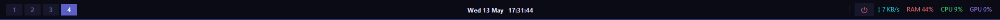
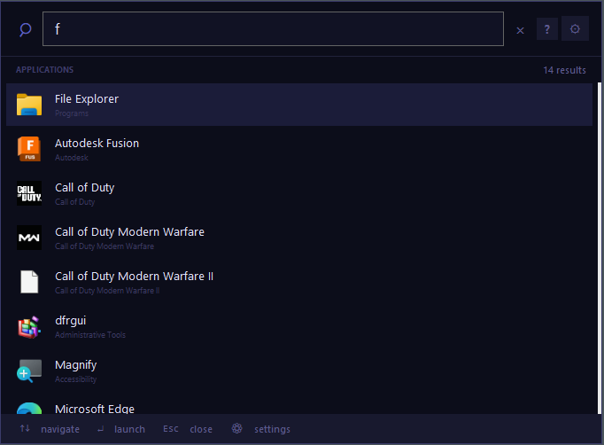

### Light
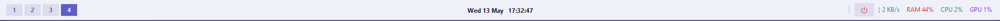
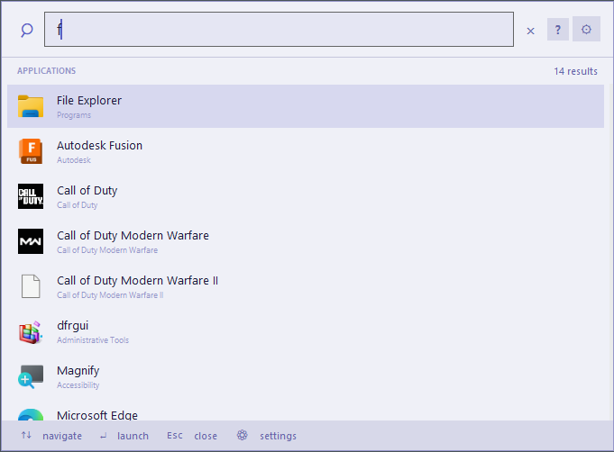

### Mocha
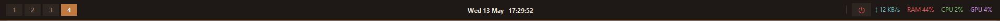
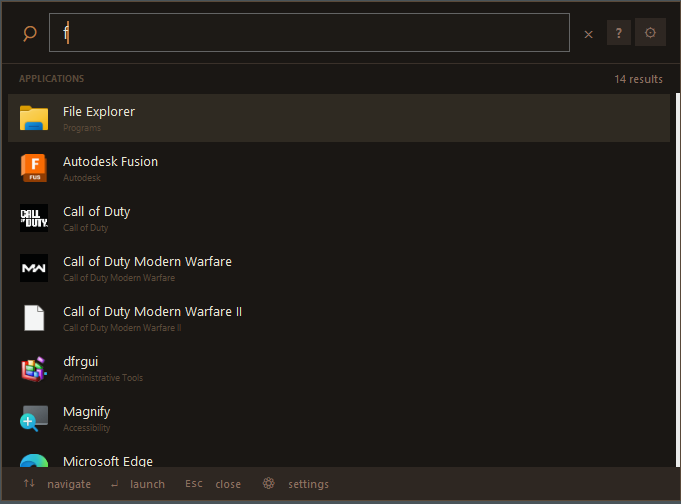

### Nord
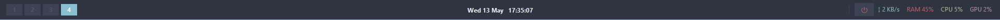
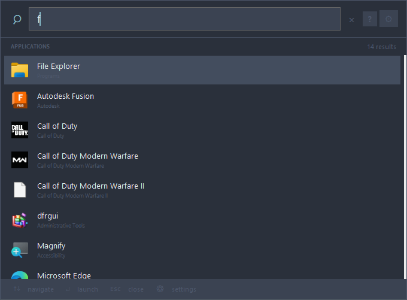

### Rose Pine
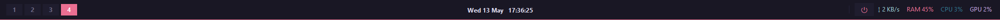
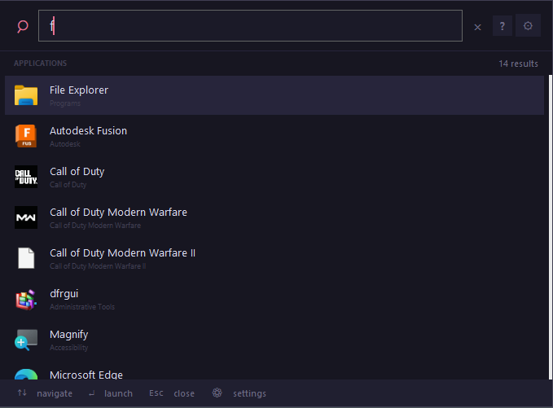

### Hacker
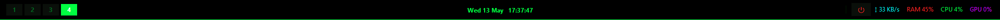
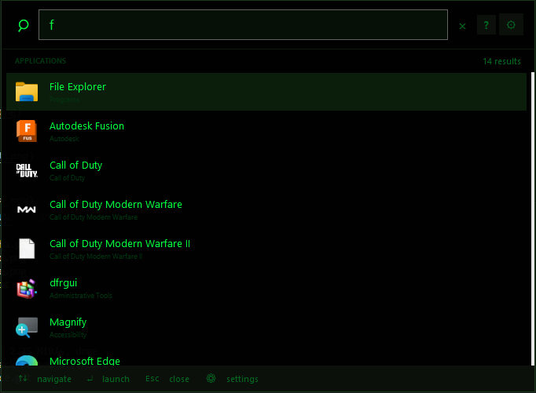

---

## Configuration

Configuration is stored in:

```text
%LOCALAPPDATA%\CustomShellBar\shellbar_config.json
```

You can configure the app in two ways:

- through the built-in config panel
- by editing the JSON file directly

### Open the config panel

- `Alt+C`
- or run `python shellbar.py --config`
- or use the power menu

---

## Config sections

### 1. General
Controls:

- theme
- bar height
- bar font family
- bar font size
- bar position
- clock format

### 2. Bar Layout
Controls:

- element order
- element visibility
- layout presets

### 3. Stats
Controls visibility for:

- CPU
- RAM
- Network
- GPU

### 4. Launcher
Controls:

- width
- maximum height
- icon size
- row height
- font family
- font size
- max results
- whether to show paths

### 5. Pinned Apps
Lets you:

- add apps
- remove apps
- rename apps
- browse for `.exe`, `.lnk`, or `.bat`

### 6. Import / Export
Lets you:

- export current config to JSON
- copy JSON to clipboard
- import config from JSON file
- paste JSON directly
- apply built-in profile presets

---

## Example config

Below is an example configuration structure:

```json
{
  "theme": "dark",
  "custom_theme": {},
  "bar": {
    "height": 40,
    "position": "top",
    "show_clock": true,
    "clock_format": "%a %d %b   %H:%M:%S",
    "show_cpu": true,
    "show_ram": true,
    "show_net": true,
    "show_gpu": true,
    "show_desktop_switcher": true,
    "font_family": "Segoe UI",
    "font_size": 9,
    "element_order": [
      "desktop_switcher",
      "pinned_apps",
      "clock",
      "gpu",
      "cpu",
      "ram",
      "net",
      "power_button"
    ],
    "element_visible": {
      "desktop_switcher": true,
      "pinned_apps": true,
      "clock": true,
      "gpu": true,
      "cpu": true,
      "ram": true,
      "net": true,
      "power_button": true
    }
  },
  "pinned_apps": [],
  "launcher": {
    "width": 680,
    "max_height": 500,
    "icon_size": 28,
    "row_height": 48,
    "font_family": "Segoe UI",
    "font_size": 10,
    "show_path": true,
    "max_results": 60
  },
  "hotkeys": {
    "launcher": "Alt+Space",
    "desktop_switch": "Alt+1..9",
    "config": "Alt+C"
  }
}
```

---

## Clock format reference

The clock uses Python `strftime` formatting.

Examples:

- `%H:%M` → `23:15`
- `%H:%M:%S` → `23:15:42`
- `%a %d %b  %H:%M` → `Tue 12 May  23:15`
- `%d/%m/%Y  %H:%M` → `12/05/2026  23:15`

---

## Pinned apps

Pinned apps appear as quick-launch buttons on the bar.

To add them:

1. Open `Settings`
2. Go to `Pinned Apps`
3. Click `+ Add App`
4. Select an `.exe`, `.lnk`, or `.bat`
5. Save changes

You can also edit the config manually:

```json
"pinned_apps": [
  {
    "name": "Firefox",
    "path": "C:\\Program Files\\Mozilla Firefox\\firefox.exe"
  },
  {
    "name": "VS Code",
    "path": "C:\\Users\\YourName\\AppData\\Local\\Programs\\Microsoft VS Code\\Code.exe"
  }
]
```

---

## Importing and exporting profiles

Use the `Import / Export` tab to save and share setups.

### Export
- save current configuration as a JSON file
- copy JSON to clipboard

### Import
- load a JSON file
- paste JSON directly into the text box

After importing, the bar restarts.

---

## Built-in profile presets

The config panel includes some quick profiles, such as:

- Developer Dark
- Minimal Light
- Gamer Hacker
- Classic Nord
- Status Rose Pine
- Cozy Mocha

These combine theme + layout choices for fast setup.

---

## Startup behavior

CustomShellBar can install itself as a Windows Scheduled Task:

- task name: `CustomShellBar`
- trigger: at logon
- install location: `%LOCALAPPDATA%\CustomShellBar\shellbar.py`

This allows the bar to start automatically when you sign in.

---

## Uninstall

### Remove startup task

```bash
python shellbar.py --uninstall
```

### Optional cleanup
You can then manually delete:

```text
%LOCALAPPDATA%\CustomShellBar
```

This removes:

- saved config
- installed script copy
- icon cache
- first-run flag

---

## Troubleshooting

### The normal Windows taskbar disappeared
CustomShellBar hides the Windows taskbar while running.

If the app exits unexpectedly, rerun it or close it cleanly so it can restore the taskbar.

### GPU stat is blank
Possible reasons:

- `pynvml` is not installed
- no NVIDIA GPU is available
- PowerShell fallback did not return valid data

Try:

```bash
pip install pynvml
```

### Virtual desktop buttons do not work
Make sure `pyvda` is installed:

```bash
pip install pyvda
```

### Icons are missing
Install Pillow:

```bash
pip install pillow
```

### CPU / RAM / network stats do not update
Install psutil:

```bash
pip install psutil
```

### Startup install failed
Try running install manually in an elevated terminal:

```bash
python shellbar.py --install
```

---

## Recommended screenshot file structure

You can store screenshots like this:

```text
docs/
  images/
    default-theme.png
    light-theme.png
    mocha-theme.png
    nord-theme.png
    rose-theme.png
    hacker-theme.png
    launcher.png
    config-window.png
    bar-layout-presets.png
    pinned-apps.png
```

---

## Notes

- This project is Windows-specific.
- Some shell integration behavior depends on Windows permissions and system setup.
- The app uses Tkinter plus Win32 / DWM APIs for styling and shell behavior.

---
